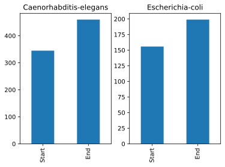

## Use a `for` loop to process files given a list of their names.

*   A filename is a character string.
*   And lists can contain character strings.

~~~
import pandas as pd
for filename in ['data/DisProt_and_pred_IDcontent.csv', 'data/DisProt_and_pred_IDcontent_length.csv']:
    data = pd.read_csv(filename, index_col=[0])
    print(filename, data.min())
~~~
{: .language-python}
~~~
../data/DisProt_and_pred_IDcontent.csv 
DisProt      0.008
Predictor    0.043
dtype: float64
../data/DisProt_and_pred_IDcontent_length.csv 
DisProt       0.008
Predictor     0.043
len          24.000
dtype: float64
~~~
{: .output}

## Use [`glob.glob`](https://docs.python.org/3/library/glob.html#glob.glob) to find sets of files whose names match a pattern.

*   In Unix, the term "globbing" means "matching a set of files with a pattern".
*   The most common patterns are:
    *   `*` meaning "match zero or more characters"
    *   `?` meaning "match exactly one character"
*   Python contains the [`glob`](https://docs.python.org/3/library/glob.html) library to provide pattern matching functionality
*   The [`glob`](https://docs.python.org/3/library/glob.html) library contains a function also called `glob` to match file patterns
*   E.g., `glob.glob('*.txt')` matches all files in the current directory 
    whose names end with `.txt`.
*   Result is a (possibly empty) list of character strings.
*   N.B. for more elaborate operations with path python has a very powerful library called [`pathlib`](https://docs.python.org/3.7/library/pathlib.html)

~~~
import glob
print('all csv files in data directory:', glob.glob('data/*.csv'))
~~~
{: .language-python}
~~~
all csv files in data directory: ['../data/DisProt_and_pred_IDcontent.csv',
 '../data/DisProt_and_pred_IDcontent_length.csv', 
'../data/DisProt_data_Caenorhabditis-elegans.csv', 
'../data/DisProt_data_Escherichia-coli.csv']
~~~
{: .output}

~~~
print('all PDB files:', glob.glob('*.pdb'))
~~~
{: .language-python}
~~~
all PDB files: []
~~~
{: .output}

## Use `glob` and `for` to process batches of files.

*   Helps a lot if the files are named and stored systematically and consistently
    so that simple patterns will find the right data.

~~~
for filename in glob.glob('data/DisProt_and_pred_*.csv'):
    data = pd.read_csv(filename)
    print(filename, data['gdpPercap_1952'].min())
~~~
{: .language-python}
~~~
../data/DisProt_and_pred_IDcontent.csv 0.008
../data/DisProt_and_pred_IDcontent_length.csv 0.008
~~~
{: .output}

*   The `DisProt_*` pattern matches all files, both IDcontent files and organisms files.
*   Use a more specific pattern in the exercises to exclude the IDcontent files.

> ## Determining Matches
>
> Which of these files is *not* matched by the expression `glob.glob('data/*ID*.csv')`?
>
> 1. `data/DisProt_data_Caenorhabditis-elegans.csv`
> 2. `data/DisProt_data_Escherichia-coli.csv`
> 3. `data/DisProt_and_pred_IDcontent.csv`
> 4. `data/DisProt_and_pred_IDcontent_length.csv`
>
> > ## Solution
> >
> > 1 and 2 are not matched by the glob.
> {: .solution}
{: .challenge}

> ## Minimum File Size
>
> Modify this program so that it prints the number of records in
> the file that has the fewest records.
>
> ~~~
> import glob
> import pandas as pd
> fewest = ____
> for filename in glob.glob('data/*.csv'):
>     dataframe = pd.____(filename)
>     fewest = min(____, dataframe.shape[0])
> print('smallest file has', fewest, 'records')
> ~~~
> {: .language-python}
> Note that the [shape method](https://pandas.pydata.org/pandas-docs/stable/reference/api/pandas.DataFrame.shape.html)
> returns a tuple with the number of rows and columns of the data frame.
>
> > ## Solution
> > ~~~
> > import glob
> > import pandas as pd
> > fewest = float('Inf')
> > for filename in glob.glob('data/*.csv'):
> >     dataframe = pd.read_csv(filename)
> >     fewest = min(fewest, dataframe.shape[0])
> > print('smallest file has', fewest, 'records')
> > ~~~
> > {: .language-python}
> {: .solution}
{: .challenge}

> ## Comparing Data
>
> Write a program that reads in the IDcontent data sets
> and plots the average GDP per capita for each region over time
> in a single chart.
> > ## Solution
> > This solution uses string [`split`](https://docs.python.org/3/library/stdtypes.html#str.rpartition) to
> > split the string filename into piece and use the extracted name as a plot title. 
> > ~~~
> > import glob
> > import pandas as pd
> > import matplotlib.pyplot as plt
> > fig, axes = plt.subplots(1, 2)
> > for i, filename in enumerate(glob.glob('../data/*data*.csv')):
> >     dataframe = pd.read_csv(filename)
> >     # extract organism name from the filename, expected to be in the format 'data/DisProt_data_<organism>.csv'.
> >     # we split the string using split using
> >     # `_` as our separator, extract the _<organism>.csv, and then strip the .csv extension
> >     organism = filename.split('_')[-1][:-4]
> >     dataframe[["Start", "End"]].mean().plot.bar(ax=axes[i], label=organism)
> >     axes[i].title.set_text(organism)
> > ~~~
> > > > {: .language-python}
> > 
> {: .solution}
{: .challenge}
